## 👋 Hi there

- You can calls me Sky, ikaros and umbrella22. If i can help you, i will be able to be extremely glad(・ω< )★

- Favorite languages: TypeScript and JavaScript.
- Favorite frameworks: Vuejs、electron、webpack、vite、rspack

- Good languages: Java Kotlin Rust

- Side projects: [electron-vue-template](https://github.com/umbrella22/electron-vue-template)、[electron-vite-template](https://github.com/umbrella22/electron-vite-template)

## 🤔 What I'm doing

- Learning Rust/JavaScript/Typescript/Java/Kotlin

## 💻 Working environment

## 📱 Devices in use

  
    
  
  
    
  

